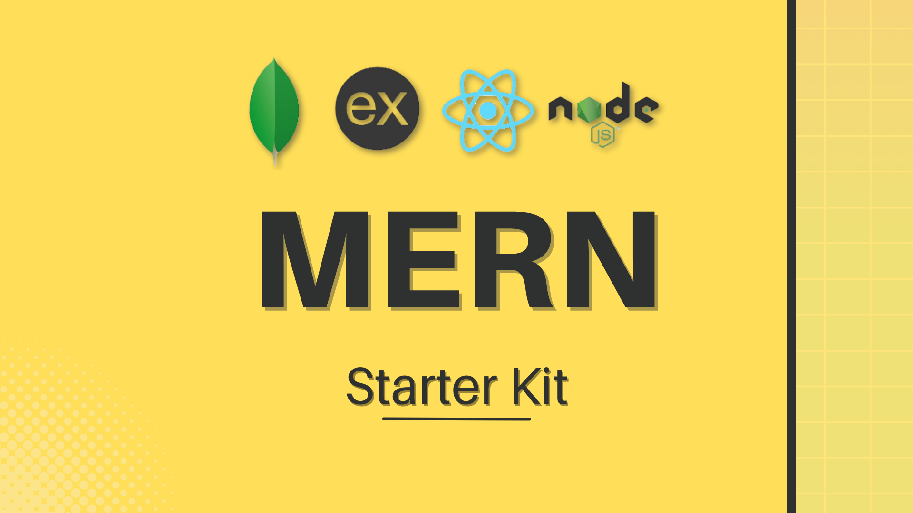

---

1. ## Setup Node.js and npm

-   Install **_Node_** and **_npm_**
-   https://nodejs.org/en (LTS Recommended)

2. ## Initialize the Project

-   First create a folder called `server` or `backend` and navigate to it.

```bash
mkdir backend
cd backend
```

-   Open your terminal and run `npm init -y` to create a `package.json` file.

3. ## Install Dependecies

-   Install necessary dependencies using the following commands

```javascript
npm i express mongoose cors
```

-   Optional Dependencies

-   **_dotenv_** - To manage environment variables
-   **_nodemon_** - To automatically restart the server when changes are made
-   **_morgan_** - To log HTTP requests
-   **_colors_** - To add colors to the console
-   **_express-validator_** - To validate incoming request data
-   **_bcrypt_** - To hash passwords
-   **_jsonwebtoken_** - To generate JWTs
-   **_cookie-parser_** - To parse cookies
-   **_zod_** - To validate data schemas

### Way to install devDependencies

-   devDependencies are dependencies that are only required during development, such as testing libraries or transpilers. They are not included in the production build. To install devDependencies, use the `-D` flag.
-   Example: `npm i nodemon -D`

```javascript
npm i <dependencies> -D
```

4. ## Add ES Modules and Scripts

-   ES Modules (ECMAScript Modules) are a way to organize code into separate files or modules. This method allows you to import/export functionality between these modules.

-   In your `package.json` add:

    -   `"type": "module"` to ensure that you have access to the functionality provided by these modules throughout your application.
    -  In the `scripts` section, add the following scripts:

        -   `"dev": "nodemon server.js"`,
        -   `"start": "node --watch --inspect --env-file=.env server.js"`
        -   `"seeder": "node --env-file=.env seeder.js"`,

### Here's a brief explanation of each:

-   `dev & start`: Starts the server in development mode with auto-restart, debugging, and environment variable loading.
-   `seeder`: Executes the seeder.js file, potentially loading environment variables from a .env file.

These scripts simplify common tasks during development and deployment of your Node.js application. You can run them using `npm` or `yarn` or `pnpm` commands like `npm run dev`, `npm run seeder` or `npm start`.


5. ## Set up Server (Node.js & Express)

-   Create a file `server.js` and set up a basic Express server
-   Also add a `.env` file to manage environment variables

```bash
touch server.js .env
```

### .env

```bash
PORT=5000
```

### server.js

```javascript
import express from "express";
import cors from "cors";
import dotenv from "dotenv";
import colors from "colors";
import morgan from "morgan";

// Managing the .env file
dotenv.config();

const app = express();
const { PORT } = process.env;

// Listen
app.listen(PORT, () => {
    console.log(`Server is running at http://localhost:${PORT}`);
});
```

7. ## Add your basic Middlewares

```javascript
// Middleware that allows browsers to accept data from this server
app.use(cors());
// Middlewares that accepts urlencoded from data request
app.use(express.urlencoded({ extended: true }));
// Middleware that accepts json format data request
app.use(express.json());
// Middleware that logs the request to the console
app.use(morgan("dev"));
```

8. ## Folder Structure

-   We are going to follow the **MVC (Model-View-Controller)** pattern for our project structure.
-   **MVC** is a _software design pattern_ that divides the application into three interconnected components: the model, the view, and the controller.
-   This pattern helps to achieve separation of concerns.
-   **Model:** Responsible for managing the data of the application. It receives user input from the controller.
-   **View:** The user interface of the application. It displays the data using the model to the user and also enables them to modify the data.
-   **Controller:** Acts as an interface between Model and View components to process all the business logic and incoming requests, manipulate data using the Model component, and interact with the Views to render the final output.

```
backend/
|-- config/
|   |-- connectDB.js
|-- controllers/
|   |-- itemController.js
|-- middleware/
|   |-- asyncHandler.js
|   |-- errorHandler.js
|-- models/
|   |-- ItemModel.js
|-- routes/
|   |-- itemRouter.js
|-- .env
|-- .gitignore
|-- package.json
|-- seeder.js
|-- server.js
```

-   For that we can create a folder structure like this.

```bash
cd backend
mkdir config controllers middleware models routes
touch .gitignore seeder.js
```

9. ## Connect to MongoDB

-   Use `mongoose` to connect your Express server to MongoDB
-   Save your `URI`in the `.env` file
-   Create a connection
-   Call this connection in your `server.js`

### .env

```bash
PORT=5000
MONGODB_URI=your_mongodb_uri
MONGO_LOCAL=your_local_mongodb_uri
```

### config/connectDB.js

```javascript
import mongoose from "mongoose";
import dotenv from "dotenv";
import colors from "colors";

dotenv.config();

// Get the MONGODB_URI from the .env file
const { MONGODB_URI } = process.env;

// Connect to the MongoDB
const connectDB = async () => {
    try {
        // Connect to the MongoDB
        const conn = await mongoose.connect(MONGODB_URI);
        // Log the connection host if the connection is successful
        console.log(`<< MongoDB Connected: ${conn.connection.host} >>`.bgGreen.white);
    } catch (error) {
        // Log the error message if the connection is failed
        console.error(":: Database Not Connection");
    }
};

export default connectDB;
```

-   Ensure to include your `.env` file in the `.gitignore` to safeguard sensitive information like API keys, passwords, or ports from being exposed.

### .gitignore

```bash
node_modules
.env
```

-   Call the `connectDB` function in your `server.js`

### server.js

```javascript
import express from "express";
import cors from "cors";
import dotenv from "dotenv";
import colors from "colors";

// Managing the .env file
dotenv.config();

// Import the connectDB function
import connectDB from "./config/connectDB.js";

// Connect to the MongoDB
await connectDB();

const app = express();
const { PORT } = process.env;

// Middleware that allows browsers to accept data from this server
app.use(cors());
// Middlewares that accepts urlencoded from data request
app.use(express.urlencoded({ extended: true }));
// Middleware that accepts json format data request
app.use(express.json());
// Middleware that logs the request to the console
app.use(morgan("dev"));

// Listen to the PORT
app.listen(PORT, () => {
    console.log(`Server is running at http://localhost:${PORT}`.bgBlue.white);
});
```
10. ## Routes

-  Navigate to the `routes` folder and create a file called `itemRouter.js`

```bash
cd routes
touch itemRouter.js
```

-  Add the following code to the `itemRouter.js` file

### routes/itemRouter.js

```javascript
import { Router } from "express";

// Import the CRUD functions from the controller
import {
    createItem,
    getAllItems,
    getItemById,
    updateItem,
    deleteItem,
    deleteAllItems
} from "../controllers/itemController.js";

// Create a new router
const itemsRouter = Router();

// CRUD -----------

// CREATE the items
itemsRouter.post("/", createItem);
// READ the items
itemsRouter.get("/", getAllItems);
// READ each movie
itemsRouter.get("/:id", getItemById);
// UPDATE the items
itemsRouter.patch("/:id", updateItem);
// DELETE the items
itemsRouter.delete("/:id", deleteItem)
// DELETE all items
itemsRouter.delete("/", deleteAllItems)

// Export the router
export default itemsRouter;

```

- Then import the `itemRouter` in the `server.js` file. 

### server.js

```javascript
import express from "express";
import cors from "cors";
import dotenv from "dotenv";
import colors from "colors";
import morgan from "morgan";

// Managing the .env file
dotenv.config();

// Import the connectDB function
import connectDB from "./config/connectDB.js";
// Connect to the MongoDB
await connectDB();

// Importing the Router
import itemRouter from "./routes/itemRouter.js";

// Create an express app
const app = express();
// Get the PORT from the .env file
const { PORT } = process.env;

// Middleware that allows browsers to accept data from this server
app.use(cors());
// Middlewares that accepts urlencoded from data request
app.use(express.urlencoded({ extended: true }));
// Middleware that accepts json format data request
app.use(express.json());
// Middleware that logs the request to the console
app.use(morgan("dev"));

// ROUTERS
app.use("/api/items", itemRouter)

// Listen to the PORT and log the message to the console
app.listen(PORT, () => {
    console.log(`Server is running at http://localhost:${PORT}`.bgBlue.white);
});
```

11. ## Models

-  Navigate to the `models` folder and create a file called `ItemModel.js`

```bash
cd models
touch ItemModel.js
```

-  Add the following code to the `ItemModel.js` file

### models/ItemModel.js

```javascript
import { Schema, model } from "mongoose";

// Create Schema
const itemSchema = new Schema(
    {
        // Define the fields and their types in the schema. Some options are: type, required, default, unique, etc.
        string: {
            type: String,
            required: true
        },
        number: {
            type: Number,
        },
        boolean: {
            type: Boolean,
        },
        // Date example 
        date: {
            type: Date,
            default: Date.now
        },
        // Array of strings example 
        arrays: {
            type: [String],
        }
    },
    {
        // Add timestamps to the schema (createdAt, updatedAt)
        timestamps: true
    }
);

// Create Model
const ItemModel = model("items", itemSchema);

// Export the model
export default ItemModel;
```

12. ## Controllers

-  Navigate to the `controllers` folder and create a file called `itemController.js`

```bash
cd controllers
touch itemController.js
```

-  Add the following code to the `itemController.js` file

### controllers/itemController.js

```javascript
// Import the ItemModel
import ItemModel from "../models/ItemModel.js";

// CREATE the items
const createItem = async (req, res) => {
    try {
        // Create a new item using the ItemModel and the request body
        const item = await ItemModel.create(req.body);
        // Send the item as a response
        res.status(201).json(item);
    } catch (error) {
        res.status(500).json({ message: error.message });
    }
};

// READ the items
const getAllItems = async (req, res) => {
    try {
        // Find all the items in the database using the ItemModel 
        const items = await ItemModel.find();
        // Send the items as a response
        res.status(200).json(items);
    } catch (error) {
        res.status(500).json({ message: error.message });
    }
};

// READ each item
const getItemById = async (req, res) => {
    try {
        // Find an item by id using the ItemModel 
        const item = await ItemModel.findById(req.params.id);
        // Send the item as a response
        res.status(200).json(item);
    } catch (error) {
        res.status(500).json({ message: error.message });
    }
};

// UPDATE the items

const updateItem = async (req, res) => {
    try {
        // Find an item by id and update it using the ItemModel 
        const itemUpdated = await ItemModel.findByIdAndUpdate(
            req.params.id,
            req.body,
            { new: true }

            // What is {new: true}?
            // By default, findByIdAndUpdate() returns the original document.
            // To return the document after update you have to pass an option: new: true.
        );
        res.status(200).json(itemUpdated);
    } catch (error) {
        res.status(500).json({ message: error.message });
    }
};

// DELETE one item
const deleteItem = async (req, res) => {
    try {
        // Find an item by id and delete it using the ItemModel 
        const itemDeleted = await ItemModel.findByIdAndDelete(req.params.id);
        res.status(200).json(itemDeleted);
    } catch (error) {
        res.status(500).json({ message: error.message });
    }
}

// DELETE all items (optional)
const deleteAllItems = async (req, res) => {
    try {
        // Delete all items using the ItemModel 
        await ItemModel.deleteMany();
        res.status(200).json({ message: "All items are deleted." });
    } catch (error) {
        res.status(500).json({ message: error.message });
    }
}

// Export the CRUD functions
export {
    createItem,
    getAllItems,
    getItemById,
    updateItem,
    deleteItem,
    deleteAllItems
};
```


<!-- some comments -->